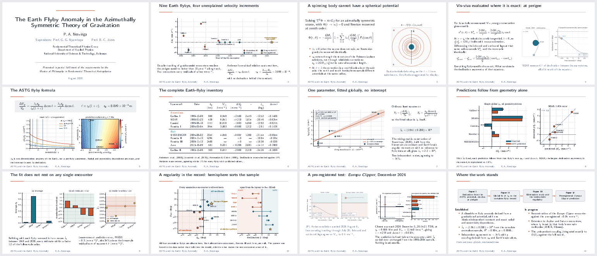

# Animated Beamer presentations with `animate`

Source for a twelve-slide LaTeX Beamer deck with three embedded animations that
play inside the PDF. No GIFs, no video files, no external player — the frames
are embedded in the PDF itself and stepped through by the reader.

This repository exists mainly because people asked how the animations in the
talk worked. The short answer is the [`animate`](https://ctan.org/pkg/animate)
package plus a Python script that renders numbered PNG frames. The long answer
is below.



---

## The short version

Three ingredients.

**1. Generate numbered frames.** Any tool that writes `name-0.png`,
`name-1.png`, … will do. Here it is matplotlib:

```python
for k in range(32):
    fig, ax = plt.subplots(figsize=(9.2, 3.9))
    # ... draw frame k ...
    fig.savefig(f"anim/flyby-{k}.png", dpi=96, bbox_inches="tight")
    plt.close(fig)
```

**2. Load the package.**

```latex
\usepackage{animate}
```

**3. Embed the sequence.**

```latex
\animategraphics[autoplay,loop,width=\textwidth]{12}{anim/flyby-}{0}{31}
```

Reading the arguments: `12` is frames per second, `anim/flyby-` is the filename
prefix, and `0` and `31` are the first and last frame numbers. `autoplay`
starts it on slide entry; `loop` repeats it. Add `controls` if you want a
play/pause bar.

That is the whole technique.

---

## The part nobody tells you

**Animations only play in Adobe Acrobat and PDF-XChange.**

They do not play in Overleaf's built-in previewer, in Chrome, Firefox or Safari's
PDF viewers, in macOS Preview, in Okular, in Evince, or in most projector
software. Those viewers show the first frame and nothing else.

This is a limitation of the PDF viewers, not of the file. `animate` uses
JavaScript embedded in the PDF, and most viewers do not implement it.

Practical consequences:

- **Present from Acrobat**, and check the machine you'll actually present on
  before the day.
- **Design every frame 0 to stand alone.** In this deck each animation's first
  frame is a complete figure. In a viewer that can't animate, the deck still
  reads correctly — you lose the motion, not the content.
- **Have a static fallback.** Swapping in first frames is a one-line change:

  ```latex
  % animated
  \animategraphics[autoplay,loop,width=\textwidth]{12}{anim/flyby-}{0}{31}
  % static fallback
  \includegraphics[width=\textwidth]{anim/flyby-0}
  ```

If you need something that plays anywhere, `animate` is the wrong tool — export
a GIF or an MP4 and put it beside the deck.

---

## Other things worth knowing

**Frame count and file size.** Three sequences of 32 frames each come to about
4.5 MB and a compiled PDF of roughly 3 MB. Frames are embedded once per
sequence, so cost scales with frame count. 24–32 frames at 12 fps gives a
smooth two-to-three second loop, which is usually plenty.

**Make loops seamless.** If a sequence should cycle without a visible jump,
drive the animation with a parameter that returns to its starting value. Here
the potential-deformation loop uses

```python
A = A_max * 0.5 * (1 - np.cos(2 * np.pi * k / n_frames))
```

so amplitude rises and falls smoothly and frame 31 flows back into frame 0.

**Use PNG, not PDF, for frames.** `animate` accepts both, but a few dozen
vector PDFs will slow compilation noticeably. Static figures stay vector; only
animation frames are raster.

**Keep `dpi` modest.** 96 dpi at Beamer sizes is sharp enough on a projector
and keeps the file manageable. Static figures in this deck are vector PDF and
unaffected.

**Compile time.** Roughly 20–30 seconds on Overleaf with all 96 frames. If
you're iterating on the text, comment the `\animategraphics` calls out and
swap the static fallbacks in.

---

## Repository layout

```
main.tex            the deck — self-contained Beamer theme, no external fonts
figs/               eight static figures (vector PDF)
anim/               96 animation frames (PNG)
astgstyle.py        shared data, palette and plotting helpers
make_figs_a.py      static figures: timeline, potential, formula behaviour
make_figs_b.py      static figures: fit, predictions, diagnostics, prediction
make_anims.py       the three animation sequences
docs/preview.png    contact sheet of all twelve slides
```

## Building

The deck needs no external fonts or theme packages — the Beamer theme is
defined inside `main.tex`, so it compiles identically anywhere.

```bash
# regenerate figures and frames (needs numpy + matplotlib)
python3 make_figs_a.py
python3 make_figs_b.py
python3 make_anims.py

# build
latexmk -pdf main.tex
```

On Overleaf: upload the whole repository, set the compiler to pdfLaTeX, and
compile. Remember that the preview pane will show first frames only.

Compiles clean: 12 pages, no errors, no overfull boxes.

## Minimal working example

If you only want the technique, this is a complete file:

```latex
\documentclass{beamer}
\usepackage{animate}
\begin{document}
\begin{frame}{An animated figure}
  \centering
  \animategraphics[autoplay,loop,width=0.8\textwidth]{12}{anim/flyby-}{0}{31}
\end{frame}
\end{document}
```

Drop `anim/flyby-0.png` … `anim/flyby-31.png` beside it and compile with
pdfLaTeX. Open in Acrobat.

---

## About the content

The deck presents work on the Earth flyby anomaly within the Azimuthally
Symmetric Theory of Gravitation, given in partial fulfilment of an MPhil in
Fundamental Theoretical Astrophysics at the National University of Science and
Technology, Bulawayo.

**Status note.** The talk was prepared before a subsequent audit of the
underlying derivation. The central claim it presents — that the ASTG accounts
for the Earth flyby anomaly — has since been withdrawn by the authors, and the
associated paper series has been substantially revised. This repository is
published for the LaTeX and figure-generation technique rather than as a
current statement of the physics. See the paper repositories under
[cerealrose](https://github.com/cerealrose) for the current position.

## License

Code and LaTeX source: MIT (see `LICENSE`).
Figures and slide content: CC BY 4.0.

## Citation

If the technique is useful in your own work, a link back is welcome but not
required. For the scientific content, please cite the papers rather than this
repository.
